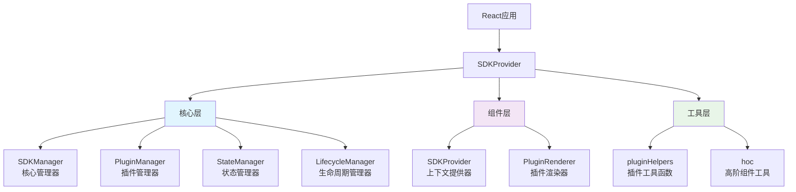

# React SDK Manager 深度解析：构建可扩展的插件化React应用

> 一个现代化的React SDK管理器，让你的应用具备强大的插件化能力和状态管理功能

## 前言

在现代前端开发中，随着应用复杂度的不断增长，我们经常面临这样的挑战：如何构建一个既灵活又可维护的应用架构？如何让不同的功能模块能够独立开发、测试和部署？如何实现真正的插件化架构？

React SDK Manager 正是为了解决这些问题而诞生的。它不仅仅是一个状态管理库，更是一个完整的插件化应用开发框架，为React应用提供了强大的扩展能力和优雅的架构设计。

## 🎯 核心理念

### 插件化优先
React SDK Manager 采用插件化优先的设计理念。每个功能模块都可以作为独立的插件存在，具有自己的生命周期、状态和UI组件。这种设计让应用具备了极强的可扩展性和可维护性。

### 声明式配置
通过简洁的配置即可完成复杂的功能集成，无需编写大量的样板代码。开发者可以专注于业务逻辑的实现，而不是基础架构的搭建。

### 类型安全
完整的TypeScript支持，从核心API到插件开发，都提供了严格的类型检查，让开发更加安全和高效。

## 🏗️ 架构设计

React SDK Manager 采用分层架构设计，主要包含以下几个核心模块：



### 核心层 (Core)
- **SDKManager**: 整个系统的协调中心，负责管理其他子系统
- **PluginManager**: 插件生命周期管理，包括注册、启用、禁用和依赖管理
- **StateManager**: 响应式状态管理，支持持久化和订阅机制
- **LifecycleManager**: 生命周期事件管理，提供完整的事件系统

### 组件层 (Components)
- **SDKProvider**: React上下文提供器，为整个应用注入SDK功能
- **PluginRenderer**: 插件渲染组件，安全地渲染插件UI

### 工具层 (Utils)
- **pluginHelpers**: 插件开发辅助函数
- **hoc**: 高阶组件工具，简化组件功能增强

## 🚀 快速开始

### 基础设置

首先，让我们看看如何在React应用中集成React SDK Manager：

### 基础示例演示

以下是一个完整的基础示例，展示了如何创建简单的计数器插件和问候语插件，并在应用中集成：

```typescript
import React from 'react';
import { SDKProvider, useSDK, useSDKState, createPlugin, PluginRenderer } from '@webscript/react-sdk-manager';

// 1. 创建计数器插件
const CounterPlugin = createPlugin({
  name: 'simple-counter',
  version: '1.0.0',
  component: () => {
    const [state, setState] = useSDKState();
    const count = state.count || 0;

    const increment = () => setState(prev => ({ ...prev, count: (prev.count || 0) + 1 }));
    const decrement = () => setState(prev => ({ ...prev, count: Math.max(0, (prev.count || 0) - 1) }));

    return (
      <div>
        <h3>🔢 智能计数器</h3>
        <div>{count}</div>
        <button onClick={decrement}>➖ 减少</button>
        <button onClick={increment}>➕ 增加</button>
        {count === 0 && <p>👋 点击按钮开始计数</p>}
        {count > 0 && count < 10 && <p>🌟 做得不错！</p>}
        {count >= 10 && <p>🎯 越来越厉害了！</p>}
      </div>
    );
  },
  hooks: {
    onMount: () => console.log('计数器插件已挂载！'),
    onStateChange: (state) => console.log('状态已更新:', state)
  }
});

// 2. 创建问候语插件
const GreetingPlugin = createPlugin({
  name: 'greeting',
  version: '1.0.0',
  component: () => {
    const [state, setState] = useSDKState();
    const userName = state.userName || '';

    const updateName = (e) => setState(prev => ({ ...prev, userName: e.target.value }));
    
    const getGreeting = () => {
      if (!userName) return '👋 请输入您的姓名';
      const hour = new Date().getHours();
      if (hour < 12) return `🌅 早上好，${userName}！`;
      if (hour < 18) return `☀️ 下午好，${userName}！`;
      return `🌙 晚上好，${userName}！`;
    };

    return (
      <div>
        <h3>👋 智能问候</h3>
        <div>{getGreeting()}</div>
        <input 
          type="text" 
          value={userName} 
          onChange={updateName} 
          placeholder="输入您的姓名..."
        />
      </div>
    );
  }
});

// 3. 主应用组件
const MyApp = () => {
  const sdk = useSDK();

  // 注册插件
  React.useEffect(() => {
    const initPlugins = async () => {
      await sdk.plugins.register(CounterPlugin);
      await sdk.plugins.register(GreetingPlugin);
      console.log('✅ 所有插件注册成功！');
    };
    initPlugins();
  }, [sdk]);

  return (
    <div>
      <PluginRenderer pluginName="greeting" />
      <PluginRenderer pluginName="simple-counter" />
    </div>
  );
};

// 4. 应用入口
const BasicExample = () => {
  const sdkConfig = {
    name: '基础示例',
    version: '1.0.0',
    debug: true,
    initialState: { count: 0, userName: '' },
    persist: true,
    persistKey: 'basic-example-state'
  };

  return (
    <SDKProvider config={sdkConfig}>
      <MyApp />
    </SDKProvider>
  );
};

export default BasicExample;
```

此示例展示了：
1. 插件创建：使用`createPlugin`定义功能插件
2. 状态管理：通过`useSDKState`共享全局状态
3. 插件注册：在应用初始化时注册插件
4. 组件渲染：使用`PluginRenderer`渲染插件UI
5. 生命周期：利用插件钩子监听状态变化

```typescript
import React from 'react';
import { SDKProvider, useSDK } from '@webscript/react-sdk-manager';

// 1. 配置SDK
const sdkConfig = {
  name: 'My Application SDK',
  version: '1.0.0',
  debug: process.env.NODE_ENV === 'development',
  initialState: {
    user: null,
    theme: 'light',
    preferences: {}
  },
  persist: true,
  persistKey: 'my-app-state'
};

// 2. 应用根组件
const App = () => {
  return (
    <SDKProvider 
      config={sdkConfig}
      onError={(error) => {
        console.error('SDK Error:', error);
        // 发送到错误监控服务
      }}
      onInitialized={(sdk) => {
        console.log('SDK Ready:', sdk.getInfo());
        // 执行初始化后的操作
      }}
    >
      <MyApplication />
    </SDKProvider>
  );
};

// 3. 使用SDK的组件
const MyApplication = () => {
  const sdk = useSDK();
  
  React.useEffect(() => {
    console.log('SDK initialized:', sdk.getInfo());
  }, [sdk]);

  return (
    <div>
      <Header />
      <MainContent />
      <PluginArea />
    </div>
  );
};
```

### 状态管理

React SDK Manager 提供了强大的状态管理能力，支持响应式更新和持久化：

```typescript
import { useSDKState } from '@webscript/react-sdk-manager';

const UserProfile = () => {
  const [state, setState] = useSDKState();

  const login = async (credentials) => {
    try {
      const user = await authService.login(credentials);
      setState(prev => ({
        ...prev,
        user,
        isAuthenticated: true
      }));
    } catch (error) {
      console.error('Login failed:', error);
    }
  };

  const updateTheme = (theme) => {
    setState(prev => ({
      ...prev,
      theme,
      preferences: {
        ...prev.preferences,
        theme
      }
    }));
  };

  return (
    <div className={`app-theme-${state.theme}`}>
      {state.user ? (
        <div>
          <h2>Welcome, {state.user.name}!</h2>
          <ThemeSelector 
            currentTheme={state.theme}
            onThemeChange={updateTheme}
          />
        </div>
      ) : (
        <LoginForm onLogin={login} />
      )}
    </div>
  );
};
```

## 🔌 插件开发

### 创建插件

React SDK Manager 的插件系统是其最强大的特性之一。让我们看看如何创建一个完整的插件：

```typescript
import { createPlugin } from '@webscript/react-sdk-manager';

const weatherPlugin = createPlugin({
  name: 'weather-widget',
  version: '1.2.0',
  dependencies: ['location-service'],
  
  // 插件初始化
  initialize: async () => {
    console.log('Weather plugin initializing...');
    await weatherService.initialize();
    console.log('Weather plugin ready');
  },
  
  // 插件销毁
  destroy: async () => {
    console.log('Weather plugin cleaning up...');
    weatherService.cleanup();
  },
  
  // React组件
  component: ({ sdk, location }) => {
    const [weather, setWeather] = React.useState(null);
    const [loading, setLoading] = React.useState(true);
    
    React.useEffect(() => {
      const fetchWeather = async () => {
        try {
          setLoading(true);
          const data = await weatherService.getWeather(location);
          setWeather(data);
        } catch (error) {
          console.error('Failed to fetch weather:', error);
        } finally {
          setLoading(false);
        }
      };
      
      fetchWeather();
    }, [location]);
    
    if (loading) {
      return <div className="weather-loading">Loading weather...</div>;
    }
    
    return (
      <div className="weather-widget">
        <h3>Weather in {location}</h3>
        <div className="weather-info">
          <span className="temperature">{weather.temperature}°C</span>
          <span className="condition">{weather.condition}</span>
        </div>
      </div>
    );
  },
  
  // 生命周期钩子
  hooks: {
    onMount: () => {
      console.log('Weather widget mounted');
      analytics.track('weather_widget_viewed');
    },
    
    onUnmount: () => {
      console.log('Weather widget unmounted');
    },
    
    onStateChange: (newState, prevState) => {
      // 响应状态变化
      if (newState.user?.location !== prevState.user?.location) {
        console.log('User location changed, updating weather');
      }
    },
    
    onError: (error) => {
      console.error('Weather widget error:', error);
      errorReporting.captureException(error, {
        tags: { plugin: 'weather-widget' }
      });
    }
  }
});
```

### 插件依赖管理

React SDK Manager 提供了完善的依赖管理系统，自动处理插件间的依赖关系：

```typescript
import { 
  sortPluginsByDependencies, 
  checkPluginCompatibility,
  validatePlugin 
} from '@webscript/react-sdk-manager';

// 创建一组相互依赖的插件
const plugins = [
  createPlugin({
    name: 'user-management',
    version: '1.0.0',
    dependencies: ['auth-service', 'user-storage']
  }),
  
  createPlugin({
    name: 'auth-service',
    version: '1.0.0',
    dependencies: ['crypto-utils']
  }),
  
  createPlugin({
    name: 'user-storage',
    version: '1.0.0',
    dependencies: ['database-connector']
  }),
  
  createPlugin({
    name: 'crypto-utils',
    version: '1.0.0'
  }),
  
  createPlugin({
    name: 'database-connector',
    version: '1.0.0'
  })
];

// 验证插件配置
plugins.forEach(plugin => {
  const errors = validatePlugin(plugin);
  if (errors.length > 0) {
    console.error(`Plugin ${plugin.name} validation failed:`, errors);
  }
});

// 检查兼容性
const newPlugin = createPlugin({
  name: 'advanced-analytics',
  version: '1.0.0',
  dependencies: ['user-management', 'missing-plugin']
});

const compatibility = checkPluginCompatibility(newPlugin, plugins);
if (!compatibility.compatible) {
  console.error('Missing dependencies:', compatibility.missingDependencies);
}

// 按依赖顺序排序
const sortedPlugins = sortPluginsByDependencies(plugins);
console.log('Installation order:', sortedPlugins.map(p => p.name));
// 输出: ['crypto-utils', 'database-connector', 'auth-service', 'user-storage', 'user-management']

// 按顺序注册插件
for (const plugin of sortedPlugins) {
  await sdk.plugins.register(plugin);
}
```

### 插件渲染

使用插件渲染组件可以安全地渲染插件UI：

```typescript
import { PluginRenderer, PluginList, PluginManager } from '@webscript/react-sdk-manager';

const Dashboard = () => {
  const [selectedLocation, setSelectedLocation] = React.useState('Beijing');
  
  return (
    <div className="dashboard">
      <h1>用户仪表板</h1>
      
      {/* 渲染单个插件 */}
      <div className="widget-area">
        <PluginRenderer 
          pluginName="weather-widget"
          props={{ location: selectedLocation }}
          fallback={<div>Weather widget not available</div>}
          onError={(error) => {
            console.error('Weather widget error:', error);
          }}
        />
      </div>
      
      {/* 渲染插件列表 */}
      <div className="widgets-grid">
        <PluginList 
          filter={(name) => name.startsWith('widget-')}
          itemProps={{ 
            theme: 'dashboard',
            userId: currentUser.id 
          }}
          onPluginError={(pluginName, error) => {
            console.error(`Plugin ${pluginName} failed:`, error);
            showNotification(`Widget ${pluginName} encountered an error`);
          }}
        />
      </div>
      
      {/* 插件管理界面 */}
      <div className="admin-section">
        <PluginManager 
          showDisabled={true}
          onPluginToggle={(pluginName, enabled) => {
            console.log(`Plugin ${pluginName} ${enabled ? 'enabled' : 'disabled'}`);
            analytics.track('plugin_toggled', { plugin: pluginName, enabled });
          }}
        />
      </div>
    </div>
  );
};
```

## 🎨 高阶组件增强

React SDK Manager 提供了丰富的高阶组件(HOC)，让组件功能增强变得简单优雅：

### 基础HOC使用

```typescript
import { 
  withSDK, 
  withState, 
  withPlugins, 
  withLifecycle,
  compose,
  WithSDKProps,
  WithStateProps,
  WithPluginsProps,
  WithLifecycleProps
} from '@webscript/react-sdk-manager';

// 定义组件Props
interface AdminPanelProps {
  title: string;
}

// 组合所有需要的Props类型
type EnhancedProps = AdminPanelProps & 
  WithSDKProps & 
  WithStateProps & 
  WithPluginsProps & 
  WithLifecycleProps;

// 创建增强组件
const AdminPanel: React.FC<EnhancedProps> = ({ 
  title, 
  sdk, 
  state, 
  setState, 
  plugins, 
  lifecycle 
}) => {
  React.useEffect(() => {
    // 监听系统事件
    const unsubscribes = [
      lifecycle.on('error', (error, context) => {
        console.error(`System error in ${context}:`, error);
        setState(prev => ({
          ...prev,
          systemErrors: [...(prev.systemErrors || []), { error, context, timestamp: Date.now() }]
        }));
      }),
      
      lifecycle.on('stateChange', (newState, prevState) => {
        console.log('Global state changed:', { newState, prevState });
      })
    ];
    
    return () => unsubscribes.forEach(fn => fn());
  }, [lifecycle, setState]);
  
  const handleSystemReset = async () => {
    try {
      await sdk.reset();
      setState(prev => ({ ...prev, systemErrors: [] }));
      console.log('System reset successfully');
    } catch (error) {
      console.error('System reset failed:', error);
    }
  };
  
  const togglePlugin = async (pluginName: string, enabled: boolean) => {
    try {
      if (enabled) {
        await plugins.disable(pluginName);
      } else {
        await plugins.enable(pluginName);
      }
    } catch (error) {
      console.error(`Failed to toggle plugin ${pluginName}:`, error);
    }
  };
  
  return (
    <div className="admin-panel">
      <h2>{title}</h2>
      
      <div className="system-info">
        <h3>系统信息</h3>
        <p>SDK版本: {sdk.getConfig().version}</p>
        <p>活跃插件: {plugins.getEnabled().length}</p>
        <p>系统错误: {state.systemErrors?.length || 0}</p>
      </div>
      
      <div className="system-controls">
        <button onClick={handleSystemReset}>重置系统</button>
      </div>
      
      <div className="plugin-management">
        <h3>插件管理</h3>
        {plugins.getAll().map(plugin => (
          <div key={plugin.name} className="plugin-item">
            <span>{plugin.name} v{plugin.version}</span>
            <button 
              onClick={() => togglePlugin(plugin.name, plugin.enabled)}
              className={plugin.enabled ? 'enabled' : 'disabled'}
            >
              {plugin.enabled ? '禁用' : '启用'}
            </button>
          </div>
        ))}
      </div>
    </div>
  );
};

// 使用compose组合多个HOC
const EnhancedAdminPanel = compose(
  withSDK,
  withState,
  withPlugins,
  withLifecycle
)(AdminPanel);

// 使用增强后的组件
<EnhancedAdminPanel title="系统管理面板" />
```

### 自定义HOC组合

```typescript
// 创建常用的HOC组合
const withFullSDKAccess = compose(
  withSDK,
  withState,
  withPlugins,
  withLifecycle
);

const withUserManagement = compose(
  withSDK,
  withState
);

const withPluginAccess = compose(
  withSDK,
  withPlugins
);

// 应用到不同的组件
const UserDashboard = withUserManagement(BaseUserDashboard);
const PluginSettings = withPluginAccess(BasePluginSettings);
const SystemMonitor = withFullSDKAccess(BaseSystemMonitor);
```

### 条件HOC

```typescript
import { withPluginGuard } from '@webscript/react-sdk-manager';

// 只有当特定插件启用时才显示的组件
const PremiumFeatures = ({ features }) => (
  <div className="premium-features">
    <h3>🌟 高级功能</h3>
    {features.map(feature => (
      <div key={feature.id} className="feature-item">
        <h4>{feature.name}</h4>
        <p>{feature.description}</p>
      </div>
    ))}
  </div>
);

// 使用插件守卫
const GuardedPremiumFeatures = withPluginGuard(
  'premium-subscription',
  <div className="upgrade-prompt">
    <h3>升级到高级版</h3>
    <p>解锁更多强大功能</p>
    <button>立即升级</button>
  </div>
)(PremiumFeatures);

// 多重守卫
const SecurePremiumFeatures = withPluginGuard(
  'auth-service',
  <div>请先登录</div>
)(
  withPluginGuard(
    'premium-subscription',
    <div>需要高级订阅</div>
  )(PremiumFeatures)
);
```

## 🔄 生命周期管理

React SDK Manager 提供了完整的生命周期管理系统，让你能够精确控制应用的各个阶段：

```typescript
import { useLifecycle } from '@webscript/react-sdk-manager';

const SystemMonitor = () => {
  const lifecycle = useLifecycle();
  const [events, setEvents] = React.useState([]);
  
  React.useEffect(() => {
    const unsubscribes = [
      // 监听系统挂载
      lifecycle.on('afterMount', () => {
        console.log('System mounted successfully');
        setEvents(prev => [...prev, {
          type: 'system_mount',
          timestamp: Date.now(),
          message: 'System initialized'
        }]);
      }),
      
      // 监听状态变化
      lifecycle.on('stateChange', (newState, prevState) => {
        console.log('State changed:', { newState, prevState });
        setEvents(prev => [...prev, {
          type: 'state_change',
          timestamp: Date.now(),
          message: `State updated: ${Object.keys(newState).join(', ')}`
        }]);
      }),
      
      // 监听错误
      lifecycle.on('error', (error, context) => {
        console.error(`Error in ${context}:`, error);
        setEvents(prev => [...prev, {
          type: 'error',
          timestamp: Date.now(),
          message: `Error in ${context}: ${error.message}`,
          severity: 'high'
        }]);
      }),
      
      // 自定义事件
      lifecycle.on('userAction', (action, data) => {
        console.log('User action:', action, data);
        setEvents(prev => [...prev, {
          type: 'user_action',
          timestamp: Date.now(),
          message: `User performed: ${action}`,
          data
        }]);
      })
    ];
    
    return () => unsubscribes.forEach(fn => fn());
  }, [lifecycle]);
  
  const triggerCustomEvent = () => {
    lifecycle.emit('userAction', 'manual_trigger', {
      source: 'system_monitor',
      timestamp: Date.now()
    });
  };
  
  const clearEvents = () => {
    setEvents([]);
  };
  
  return (
    <div className="system-monitor">
      <div className="monitor-header">
        <h3>系统监控</h3>
        <div className="controls">
          <button onClick={triggerCustomEvent}>触发事件</button>
          <button onClick={clearEvents}>清除日志</button>
        </div>
      </div>
      
      <div className="event-log">
        {events.map((event, index) => (
          <div 
            key={index} 
            className={`event-item ${event.severity || 'normal'}`}
          >
            <span className="timestamp">
              {new Date(event.timestamp).toLocaleTimeString()}
            </span>
            <span className="type">{event.type}</span>
            <span className="message">{event.message}</span>
          </div>
        ))}
      </div>
    </div>
  );
};
```

## 🎯 实际应用场景

### 高级示例演示

以下是一个完整的高级示例，展示了如何构建一个包含多个插件的企业级应用：

```typescript
import React from 'react';
import { 
  SDKProvider, 
  useSDK, 
  useSDKState, 
  createPlugin, 
  PluginRenderer,
  PluginManagerComponent,
  withSDK,
  withState,
  withPlugins,
  withLifecycle,
  compose
} from '@webscript/react-sdk-manager';

// 1. 用户认证插件
const AuthPlugin = createPlugin({
  name: 'auth-service',
  version: '1.0.0',
  initialize: async () => {
    console.log('认证服务初始化...');
    // 模拟初始化过程
    await new Promise(resolve => setTimeout(resolve, 500));
  },
  component: ({ sdk }) => {
    const [state, setState] = useSDKState();
    
    const login = async () => {
      // 模拟登录过程
      await new Promise(resolve => setTimeout(resolve, 300));
      setState(prev => ({
        ...prev,
        user: { id: 'user-123', name: '张三', role: 'admin' },
        isAuthenticated: true
      }));
    };
    
    const logout = () => {
      setState(prev => ({ ...prev, user: null, isAuthenticated: false }));
    };
    
    return state.isAuthenticated ? (
      <div>
        <p>欢迎, {state.user.name}!</p>
        <button onClick={logout}>退出登录</button>
      </div>
    ) : (
      <button onClick={login}>登录</button>
    );
  }
});

// 2. 数据分析插件
const AnalyticsPlugin = createPlugin({
  name: 'analytics-dashboard',
  version: '1.0.0',
  dependencies: ['auth-service'],
  component: ({ sdk }) => {
    const [state] = useSDKState();
    const [data, setData] = React.useState(null);
    
    React.useEffect(() => {
      if (state.isAuthenticated) {
        // 模拟数据加载
        setTimeout(() => {
          setData({
            visits: 1245,
            conversions: 245,
            revenue: 12450
          });
        }, 800);
      }
    }, [state.isAuthenticated]);
    
    if (!state.isAuthenticated) {
      return <div>请先登录查看分析数据</div>;
    }
    
    if (!data) {
      return <div>加载分析数据中...</div>;
    }
    
    return (
      <div>
        <h3>数据分析仪表板</h3>
        <div>
          <p>访问量: {data.visits}</p>
          <p>转化率: {data.conversions}</p>
          <p>收入: ¥{data.revenue}</p>
        </div>
      </div>
    );
  }
});

// 3. 通知中心插件
const NotificationsPlugin = createPlugin({
  name: 'notifications',
  version: '1.0.0',
  component: ({ sdk }) => {
    const [notifications, setNotifications] = React.useState([]);
    
    React.useEffect(() => {
      // 模拟获取通知
      setTimeout(() => {
        setNotifications([
          { id: 1, message: '系统更新将于今晚进行', read: false },
          { id: 2, message: '您有新的消息', read: false }
        ]);
      }, 1000);
    }, []);
    
    const markAsRead = (id) => {
      setNotifications(prev => 
        prev.map(n => n.id === id ? {...n, read: true} : n)
      );
    };
    
    return (
      <div>
        <h3>通知中心</h3>
        <ul>
          {notifications.map(notification => (
            <li key={notification.id} style={{ 
              fontWeight: notification.read ? 'normal' : 'bold' 
            }}>
              {notification.message}
              {!notification.read && (
                <button onClick={() => markAsRead(notification.id)}>
                  标记为已读
                </button>
              )}
            </li>
          ))}
        </ul>
      </div>
    );
  }
});

// 4. 系统管理面板组件
const SystemAdminPanel = ({ sdk, state, setState, plugins }) => {
  const resetSystem = async () => {
    await sdk.reset();
    setState(prev => ({ ...prev, systemLogs: [] }));
  };
  
  const togglePlugin = async (pluginName, enabled) => {
    if (enabled) {
      await plugins.disable(pluginName);
    } else {
      await plugins.enable(pluginName);
    }
  };
  
  return (
    <div>
      <h2>系统管理面板</h2>
      <div>
        <h3>系统信息</h3>
        <p>SDK版本: {sdk.getConfig().version}</p>
        <p>活跃插件: {plugins.getEnabled().length}</p>
      </div>
      
      <div>
        <button onClick={resetSystem}>重置系统</button>
      </div>
      
      <div>
        <h3>插件管理</h3>
        {plugins.getAll().map(plugin => (
          <div key={plugin.name}>
            <span>{plugin.name} v{plugin.version}</span>
            <button 
              onClick={() => togglePlugin(plugin.name, plugin.enabled)}
            >
              {plugin.enabled ? '禁用' : '启用'}
            </button>
          </div>
        ))}
      </div>
    </div>
  );
};

// 5. 使用HOC增强系统管理面板
const EnhancedSystemAdminPanel = compose(
  withSDK,
  withState,
  withPlugins
)(SystemAdminPanel);

// 6. 主应用组件
const EnterpriseApp = () => {
  const sdk = useSDK();
  
  // 注册插件
  React.useEffect(() => {
    const initPlugins = async () => {
      try {
        await sdk.plugins.register(AuthPlugin);
        await sdk.plugins.register(AnalyticsPlugin);
        await sdk.plugins.register(NotificationsPlugin);
        console.log('✅ 所有插件注册成功！');
      } catch (error) {
        console.error('❌ 插件注册失败:', error);
      }
    };
    
    initPlugins();
  }, [sdk]);

  return (
    <div>
      <header>
        <h1>企业管理系统</h1>
        <PluginRenderer pluginName="auth-service" />
      </header>
      
      <main>
        <div>
          <PluginRenderer pluginName="analytics-dashboard" />
        </div>
        
        <div>
          <PluginRenderer pluginName="notifications" />
        </div>
        
        <div>
          <EnhancedSystemAdminPanel />
        </div>
      </main>
    </div>
  );
};

// 7. 应用入口
const CompleteDemo = () => {
  const sdkConfig = {
    name: '企业管理系统 SDK',
    version: '1.0.0',
    debug: true,
    initialState: {
      user: null,
      isAuthenticated: false,
      systemLogs: []
    },
    persist: true,
    persistKey: 'enterprise-demo-state'
  };

  return (
    <SDKProvider config={sdkConfig}>
      <EnterpriseApp />
    </SDKProvider>
  );
};

export default CompleteDemo;
```

此高级示例展示了：
1. 多插件集成：认证服务、数据分析、通知中心
2. 插件依赖管理：数据分析插件依赖认证服务
3. HOC高级用法：增强系统管理面板组件
4. 复杂状态管理：用户认证状态、通知状态等
5. 插件生命周期：初始化过程和状态管理

### 电商平台插件化

让我们看看如何使用React SDK Manager构建一个插件化的电商平台：

```typescript
// 1. 基础插件 - 用户认证
const authPlugin = createPlugin({
  name: 'auth-service',
  version: '1.0.0',
  
  initialize: async () => {
    await authService.initialize();
  },
  
  component: ({ sdk }) => {
    const [state, setState] = useSDKState();
    
    const login = async (credentials) => {
      const user = await authService.login(credentials);
      setState(prev => ({ ...prev, user, isAuthenticated: true }));
    };
    
    return state.isAuthenticated ? (
      <UserProfile user={state.user} />
    ) : (
      <LoginForm onLogin={login} />
    );
  }
});

// 2. 商品管理插件
const productPlugin = createPlugin({
  name: 'product-management',
  version: '1.0.0',
  dependencies: ['auth-service'],
  
  component: ({ sdk }) => {
    const [products, setProducts] = React.useState([]);
    const [state] = useSDKState();
    
    React.useEffect(() => {
      if (state.isAuthenticated) {
        loadProducts().then(setProducts);
      }
    }, [state.isAuthenticated]);
    
    return (
      <div className="product-management">
        <h3>商品管理</h3>
        <ProductList products={products} />
        <ProductForm onSubmit={handleAddProduct} />
      </div>
    );
  }
});

// 3. 购物车插件
const cartPlugin = createPlugin({
  name: 'shopping-cart',
  version: '1.0.0',
  dependencies: ['auth-service', 'product-management'],
  
  component: ({ sdk }) => {
    const [state, setState] = useSDKState();
    
    const addToCart = (product) => {
      setState(prev => ({
        ...prev,
        cart: {
          ...prev.cart,
          items: [...(prev.cart?.items || []), product]
        }
      }));
    };
    
    return (
      <ShoppingCart 
        items={state.cart?.items || []}
        onAddItem={addToCart}
      />
    );
  }
});

// 4. 支付插件
const paymentPlugin = createPlugin({
  name: 'payment-service',
  version: '1.0.0',
  dependencies: ['auth-service', 'shopping-cart'],
  
  component: ({ sdk }) => {
    const [state, setState] = useSDKState();
    
    const processPayment = async (paymentData) => {
      try {
        const result = await paymentService.process(paymentData);
        setState(prev => ({
          ...prev,
          cart: { items: [] }, // 清空购物车
          orders: [...(prev.orders || []), result.order]
        }));
      } catch (error) {
        console.error('Payment failed:', error);
      }
    };
    
    return (
      <PaymentForm 
        total={calculateTotal(state.cart?.items)}
        onPayment={processPayment}
      />
    );
  }
});

// 5. 主应用
const ECommerceApp = () => {
  const sdkConfig = {
    name: 'E-Commerce Platform',
    version: '1.0.0',
    initialState: {
      user: null,
      isAuthenticated: false,
      cart: { items: [] },
      orders: []
    },
    persist: true
  };
  
  return (
    <SDKProvider config={sdkConfig}>
      <div className="ecommerce-app">
        <header>
          <h1>电商平台</h1>
          <PluginRenderer pluginName="auth-service" />
        </header>
        
        <main>
          <div className="product-section">
            <PluginRenderer pluginName="product-management" />
          </div>
          
          <div className="cart-section">
            <PluginRenderer pluginName="shopping-cart" />
          </div>
          
          <div className="payment-section">
            <PluginRenderer pluginName="payment-service" />
          </div>
        </main>
        
        <footer>
          <PluginManager showDisabled={false} />
        </footer>
      </div>
    </SDKProvider>
  );
};
```

### 企业级仪表板

```typescript
// 数据可视化插件
const analyticsPlugin = createPlugin({
  name: 'analytics-dashboard',
  version: '2.0.0',
  dependencies: ['data-service'],
  
  component: ({ sdk, timeRange = '7d' }) => {
    const [analytics, setAnalytics] = React.useState(null);
    
    React.useEffect(() => {
      dataService.getAnalytics(timeRange).then(setAnalytics);
    }, [timeRange]);
    
    return (
      <div className="analytics-dashboard">
        <h3>数据分析</h3>
        <ChartContainer data={analytics} />
        <MetricsGrid metrics={analytics?.metrics} />
      </div>
    );
  }
});

// 用户管理插件
const userManagementPlugin = createPlugin({
  name: 'user-management',
  version: '1.0.0',
  dependencies: ['auth-service'],
  
  component: ({ sdk }) => {
    const [users, setUsers] = React.useState([]);
    const [state] = useSDKState();
    
    const isAdmin = state.user?.role === 'admin';
    
    if (!isAdmin) {
      return <div>权限不足</div>;
    }
    
    return (
      <div className="user-management">
        <h3>用户管理</h3>
        <UserTable users={users} />
        <UserForm onSubmit={handleCreateUser} />
      </div>
    );
  }
});

// 企业仪表板主应用
const EnterpriseDashboard = () => {
  return (
    <SDKProvider config={enterpriseConfig}>
      <div className="enterprise-dashboard">
        <Sidebar>
          <Navigation />
        </Sidebar>
        
        <MainContent>
          <PluginList 
            filter={(name) => name.includes('dashboard')}
            itemProps={{ layout: 'grid' }}
          />
        </MainContent>
        
        <AdminPanel>
          <PluginManager showDisabled={true} />
        </AdminPanel>
      </div>
    </SDKProvider>
  );
};
```

## 🚀 性能优化

### 1. 插件懒加载

React SDK Manager 支持插件懒加载，仅在需要时加载插件资源：

```typescript
import { createPlugin } from '@webscript/react-sdk-manager';

// 创建懒加载插件
const createLazyPlugin = (config) => {
  return createPlugin({
    ...config,
    component: React.lazy(() => import(`./plugins/${config.name}`)),
    
    initialize: async () => {
      // 延迟初始化，避免阻塞主线程
      await new Promise(resolve => setTimeout(resolve, 0));
      console.log(`Plugin ${config.name} initialized lazily`);
    }
  });
};

// 使用懒加载
const heavyAnalyticsPlugin = createLazyPlugin({
  name: 'heavy-analytics',
  version: '1.0.0'
});

// 在组件中使用Suspense
const PluginArea = () => (
  <React.Suspense fallback={<div>Loading plugin...</div>}>
    <PluginRenderer pluginName="heavy-analytics" />
  </React.Suspense>
);
```

### 2. 状态管理优化

使用选择器函数避免不必要的重新渲染：

```typescript
import { useSDKStateSelector } from '@webscript/react-sdk-manager';

const UserProfile = () => {
  // 只订阅user对象的变化
  const user = useSDKStateSelector(state => state.user);
  
  if (!user) return <div>Loading user...</div>;
  
  return (
    <div>
      <h3>{user.name}</h3>
      <p>{user.email}</p>
    </div>
  );
};
```

### 3. 批量状态更新

使用批量更新API减少渲染次数：

```typescript
import { batchStateUpdates } from '@webscript/react-sdk-manager';

const updateUserProfile = async (userData) => {
  // 批量更新多个状态
  await batchStateUpdates(sdk => {
    sdk.setState(prev => ({ ...prev, user: userData }));
    sdk.setState(prev => ({ ...prev, lastUpdated: Date.now() }));
    sdk.setState(prev => ({ ...prev, profileStatus: 'updated' }));
  });
  
  console.log('All state updates completed');
};
```

### 4. 内存管理

确保插件在卸载时正确清理资源：

```typescript
const dataFetchingPlugin = createPlugin({
  name: 'data-fetcher',
  version: '1.0.0',
  
  component: ({ sdk }) => {
    const [data, setData] = React.useState(null);
    const controller = new AbortController();
    
    React.useEffect(() => {
      fetchData(controller.signal).then(setData);
      
      return () => {
        // 组件卸载时取消请求
        controller.abort();
      };
    }, []);
    
    return data ? <DataViewer data={data} /> : <LoadingSpinner />;
  },
  
  destroy: async () => {
    // 插件卸载时清理全局资源
    cleanupGlobalResources();
  }
});
```

### 5. 代码分割

结合动态导入实现代码分割：

```typescript
const Dashboard = React.lazy(() => import('./Dashboard'));
const AdminPanel = React.lazy(() => import('./AdminPanel'));

const AppRouter = () => {
  const [state] = useSDKState();
  
  return (
    <React.Suspense fallback={<FullPageLoader />}>
      {state.user?.role === 'admin' ? <AdminPanel /> : <Dashboard />}
    </React.Suspense>
  );
};
```

### 6. 性能监控

集成性能监控插件：

```typescript
const perfMonitorPlugin = createPlugin({
  name: 'performance-monitor',
  version: '1.0.0',
  
  hooks: {
    onMount: () => {
      // 开始性能监控
      perf.startMonitoring();
    },
    
    onRender: (componentName, duration) => {
      if (duration > 100) {
        console.warn(`Slow render in ${componentName}: ${duration}ms`);
      }
    },
    
    onUnmount: () => {
      // 生成性能报告
      const report = perf.generateReport();
      sendAnalytics('performance_metrics', report);
    }
  }
});
```

### 7. 缓存策略

实现智能缓存减少重复请求：

```typescript
const withDataCache = (fetchFn, cacheKey, ttl = 300000) => {
  return function WrappedComponent(props) {
    const [data, setData] = React.useState(null);
    const cache = useSDK().cache;
    
    React.useEffect(() => {
      const fetchData = async () => {
        // 检查缓存
        const cached = cache.get(cacheKey);
        if (cached && Date.now() - cached.timestamp < ttl) {
          setData(cached.data);
          return;
        }
        
        // 获取新数据
        const newData = await fetchFn();
        setData(newData);
        
        // 更新缓存
        cache.set(cacheKey, {
          data: newData,
          timestamp: Date.now()
        });
      };
      
      fetchData();
    }, [cache, cacheKey, ttl]);
    
    return props.children(data);
  };
};

// 使用缓存高阶组件
const CachedUserList = withDataCache(
  () => fetchUsers(),
  'user-list'
)(({ data }) => (
  <UserList users={data || []} />
));
```

### 8. 虚拟化长列表

对于大数据量使用虚拟化技术：

```typescript
import { FixedSizeList } from 'react-window';

const BigDataPlugin = createPlugin({
  name: 'big-data-viewer',
  version: '1.0.0',
  
  component: () => {
    const [items] = useSDKStateSelector(state => state.bigDataItems);
    
    const Row = ({ index, style }) => (
      <div style={style}>
        <ListItem item={items[index]} />
      </div>
    );
    
    return (
      <FixedSizeList
        height={600}
        width="100%"
        itemSize={50}
        itemCount={items.length}
      >
        {Row}
      </FixedSizeList>
    );
  }
});
```

### 9. Web Worker 集成

将计算密集型任务移入 Web Worker：

```typescript
const dataProcessorPlugin = createPlugin({
  name: 'data-processor',
  version: '1.0.0',
  
  component: ({ sdk }) => {
    const [result, setResult] = React.useState(null);
    const workerRef = React.useRef();
    
    React.useEffect(() => {
      workerRef.current = new Worker('./dataProcessor.worker.js');
      
      workerRef.current.onmessage = (event) => {
        setResult(event.data);
      };
      
      return () => {
        workerRef.current.terminate();
      };
    }, []);
    
    const processData = (data) => {
      workerRef.current.postMessage(data);
    };
    
    return (
      <div>
        <DataInput onSubmit={processData} />
        <ResultViewer result={result} />
      </div>
    );
  }
});
```

### 10. 性能分析工具

使用内置工具进行性能分析：

```typescript
const config = {
  // ...其他配置
  performance: {
    enable: true,
    logLevel: 'warn', // 'debug', 'info', 'warn', 'error'
    thresholds: {
      render: 100, // 超过100ms的渲染会记录警告
      stateUpdate: 50, // 超过50ms的状态更新会记录警告
      pluginInit: 200 // 超过200ms的插件初始化会记录警告
    }
  }
};

// 在应用中使用
<SDKProvider config={config}>
  <App />
</SDKProvider>
```

## 💡 最佳实践

基于实际项目经验，以下是使用 React SDK Manager 开发插件化应用的最佳实践：

### 1. 从简单开始
- 从基础插件开始，逐步增加复杂性
- 先实现核心功能，再添加高级特性
- 避免在初期过度设计插件架构

```typescript
// 简单插件示例
const SimplePlugin = createPlugin({
  name: 'simple-plugin',
  version: '1.0.0',
  component: () => <div>基础功能</div>
});
```

### 2. 类型安全优先
- 始终使用 TypeScript 开发
- 为所有插件定义清晰的接口类型
- 利用泛型增强类型推断能力

```typescript
interface PluginProps<T> {
  data: T;
  onUpdate: (newData: T) => void;
}

const TypedPlugin = createPlugin<PluginProps<string>>({
  name: 'typed-plugin',
  version: '1.0.0',
  component: ({ data, onUpdate }) => (
    <input value={data} onChange={e => onUpdate(e.target.value)} />
  )
});
```

### 3. 错误边界处理
- 为每个插件实现错误边界
- 使用全局错误处理机制
- 提供用户友好的错误反馈

```typescript
const SafePluginRenderer = ({ pluginName }) => (
  <ErrorBoundary 
    fallback={<ErrorFallback />}
    onError={(error) => logError(error)}
  >
    <PluginRenderer pluginName={pluginName} />
  </ErrorBoundary>
);
```

### 4. 测试驱动开发
- 为插件编写单元测试
- 测试插件集成场景
- 模拟各种边界条件

```typescript
describe('CounterPlugin', () => {
  test('应正确增加计数', () => {
    const { getByText } = render(<PluginRenderer pluginName="counter" />);
    fireEvent.click(getByText('增加'));
    expect(getByText('1')).toBeInTheDocument();
  });
});
```

### 5. 文档化优先
- 为每个插件编写详细文档
- 使用 JSDoc 注释
- 提供使用示例和场景说明

```typescript
/**
 * 用户管理插件
 * 
 * 提供用户认证、资料管理等功能
 * 
 * @example
 * <PluginRenderer pluginName="user-management" />
 * 
 * @dependencies auth-service, user-storage
 */
const UserPlugin = createPlugin({
  // ...
});
```

### 6. 性能优化策略
- 对非关键插件使用懒加载
- 优化状态选择器避免不必要的重渲染
- 使用 Web Worker 处理计算密集型任务

```typescript
// 懒加载插件
const LazyPlugin = createLazyPlugin({
  name: 'heavy-plugin',
  version: '1.0.0'
});
```

### 7. 状态管理原则
- 谨慎使用全局状态
- 在可能时优先使用本地状态
- 将状态按功能模块划分

```typescript
// 使用本地状态
const LocalStatePlugin = createPlugin({
  component: () => {
    const [localState, setLocalState] = useState();
    // ...
  }
});
```

### 8. 依赖管理
- 设计清晰的依赖层次结构
- 避免循环依赖
- 使用语义化版本控制

```typescript
const DependentPlugin = createPlugin({
  name: 'dependent-plugin',
  version: '1.0.0',
  dependencies: ['base-plugin@^1.2.0']
});
```

### 9. 插件通信
- 使用自定义事件进行插件间通信
- 避免直接访问其他插件的状态
- 定义清晰的通信协议

```typescript
// 插件A发送事件
lifecycle.emit('data-updated', { type: 'user', id: 123 });

// 插件B监听事件
useEffect(() => {
  const unsubscribe = lifecycle.on('data-updated', (data) => {
    if (data.type === 'user') {
      refreshUserData(data.id);
    }
  });
  
  return unsubscribe;
}, []);
```

### 10. 渐进式增强
- 支持插件按需加载
- 提供优雅降级方案
- 实现功能检测机制

```typescript
const EnhancedFeature = withFeatureDetection(
  'advanced-feature',
  <BasicFeature />,
  <AdvancedFeature />
);
```

## 📌 总结

React SDK Manager 通过其创新的插件化架构和强大的功能集，为构建现代React应用提供了一个全新的解决方案。以下是其核心优势：

### 核心优势
- **模块化架构**：通过插件系统实现功能解耦，提升代码可维护性
- **灵活扩展**：支持动态加载/卸载插件，实现应用功能的按需扩展
- **类型安全**：完整的TypeScript支持，确保开发过程中的类型安全
- **响应式状态管理**：基于观察者模式的状态管理，实现高效的UI更新
- **生命周期控制**：精细的生命周期管理，确保资源的合理使用和释放
- **高阶组件增强**：提供丰富的HOC工具，简化组件功能增强

### 示例应用场景

#### 1. 企业仪表板
- **基于角色的访问控制**：不同角色用户看到不同的功能模块
- **模块化UI组件**：每个业务模块作为独立插件开发
- **实时数据更新**：通过状态管理实现数据实时同步
- **插件依赖管理**：确保功能模块按正确顺序加载

```typescript
// 企业仪表板配置
const dashboardConfig = {
  plugins: [
    'user-management',
    'analytics-dashboard',
    'report-generator',
    'notification-center'
  ],
  dependencies: {
    'analytics-dashboard': ['data-service'],
    'report-generator': ['analytics-dashboard']
  }
};
```

#### 2. 电商平台
- **产品目录管理**：商品展示、分类和搜索功能
- **购物车功能**：跨页面状态保持的购物车系统
- **用户身份验证**：安全的用户认证和权限管理
- **分析和报告**：销售数据实时分析和可视化

```typescript
// 电商平台插件配置
const ecommercePlugins = [
  'product-catalog',
  'shopping-cart',
  'user-auth',
  'payment-gateway',
  'sales-analytics'
];
```

#### 3. 管理面板
- **用户管理界面**：用户CRUD操作和权限设置
- **系统配置**：灵活的系统参数配置界面
- **审计日志**：操作记录和系统事件追踪
- **备份和恢复**：数据备份和恢复功能

```typescript
// 管理面板插件
const adminPanelPlugins = [
  'user-manager',
  'system-config',
  'audit-log',
  'backup-restore'
];
```

#### 4. 内容管理系统
- **动态内容插件**：可扩展的内容类型管理
- **媒体画廊**：图片、视频等多媒体管理
- **SEO优化**：自动生成SEO友好的元数据
- **多语言支持**：国际化内容管理和翻译

```typescript
// CMS插件配置
const cmsPlugins = [
  'content-types',
  'media-gallery',
  'seo-optimizer',
  'i18n-manager'
];
```

### 开发者收益
- **提升开发效率**：通过声明式配置减少样板代码
- **降低维护成本**：模块化设计使代码更易理解和维护
- **增强应用性能**：懒加载和优化技术确保应用的高性能
- **简化团队协作**：插件化架构支持团队并行开发
- **保障应用质量**：类型安全和完善的错误处理机制提升应用稳定性

React SDK Manager 不仅仅是一个开发工具，更是一种现代前端架构的设计理念。它通过创新的插件化机制和强大的功能集，为构建可扩展、可维护的React应用提供了一套完整的解决方案。无论是初创项目还是企业级应用，都能从中获得显著的开发效率提升和架构优势。
