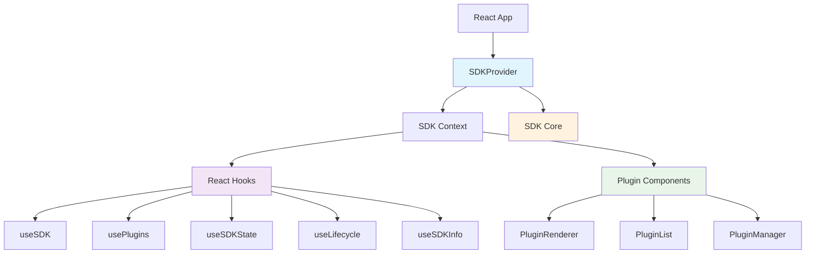

# Components 组件文档索引

本目录包含 React SDK Manager 的 React 组件文档。这些组件提供了完整的 React 集成，使开发者能够轻松地在 React 应用中使用 SDK 功能。

## 组件概览

### 🎯 [SDKProvider](./SDKProvider.md) - SDK上下文提供器
React SDK Manager 的核心React组件，提供SDK的React上下文集成。

**主要功能:**
- SDK初始化和生命周期管理
- React Context提供SDK实例
- 错误处理和UI状态管理
- 提供完整的React Hooks集合

**核心Hooks:**
- `useSDK()` - 获取SDK实例
- `usePlugins()` - 获取插件管理器
- `useSDKState()` - 响应式状态管理
- `useLifecycle()` - 生命周期管理
- `useSDKInfo()` - SDK信息查询

---

### 🔌 [PluginRenderer](./PluginRenderer.md) - 插件渲染组件集合
用于渲染和管理插件的React组件集合，提供插件的可视化和管理功能。

**包含组件:**
- `PluginRenderer` - 单个插件渲染器
- `PluginList` - 插件列表组件
- `PluginManager` - 插件管理界面

**主要功能:**
- 安全的插件组件渲染
- 插件状态检查和错误处理
- 批量插件渲染和管理
- 插件启用/禁用界面

## 架构关系



## 使用流程

### 1. 基本集成流程
```
1. 配置SDK → 2. 包装应用 → 3. 使用Hooks → 4. 渲染插件
   SDKConfig    SDKProvider     useSDK等      PluginRenderer
```

### 2. 组件层次结构
```
App
├── SDKProvider (提供SDK上下文)
│   ├── ErrorBoundary (错误边界)
│   ├── LoadingState (加载状态)
│   └── Children (应用组件)
│       ├── useSDK() (获取SDK)
│       ├── useSDKState() (状态管理)
│       └── PluginRenderer (渲染插件)
```

## 核心特性

### 🔄 响应式集成
- **自动状态同步**: 组件自动响应SDK状态变化
- **生命周期集成**: 与React组件生命周期完美集成
- **内存管理**: 自动处理订阅和清理

### 🛡️ 错误处理
- **错误边界**: 内置错误边界保护应用稳定性
- **优雅降级**: 插件错误不影响主应用
- **调试支持**: 开发模式下提供详细错误信息

### ⚡ 性能优化
- **懒加载**: 支持插件懒加载
- **记忆化**: 使用React.memo优化渲染
- **批量更新**: 优化状态更新性能

### 🎨 灵活渲染
- **条件渲染**: 支持基于条件的插件渲染
- **自定义布局**: 灵活的插件布局方案
- **主题支持**: 支持主题和样式定制

## 快速开始

### 1. 基本设置

```typescript
import React from 'react';
import { SDKProvider, useSDK } from '@react-sdk/manager';

// 1. 配置SDK
const sdkConfig = {
  name: 'My App SDK',
  version: '1.0.0',
  debug: true,
  initialState: {
    user: null,
    theme: 'light'
  },
  persist: true
};

// 2. 应用根组件
const App = () => {
  return (
    <SDKProvider 
      config={sdkConfig}
      onError={(error) => console.error('SDK Error:', error)}
      onInitialized={(sdk) => console.log('SDK Ready:', sdk.getInfo())}
    >
      <MyApplication />
    </SDKProvider>
  );
};

// 3. 使用SDK的组件
const MyApplication = () => {
  const sdk = useSDK();
  
  React.useEffect(() => {
    console.log('SDK initialized:', sdk.getInfo());
  }, [sdk]);

  return (
    <div>
      <h1>My Application</h1>
      <UserProfile />
      <PluginDashboard />
    </div>
  );
};
```

### 2. 状态管理

```typescript
const UserProfile = () => {
  const [state, setState] = useSDKState();

  const login = (userData) => {
    setState(prev => ({
      ...prev,
      user: userData
    }));
  };

  const logout = () => {
    setState(prev => ({
      ...prev,
      user: null
    }));
  };

  return (
    <div>
      {state.user ? (
        <div>
          <h2>Welcome, {state.user.name}!</h2>
          <button onClick={logout}>Logout</button>
        </div>
      ) : (
        <button onClick={() => login({ name: 'John Doe' })}>
          Login
        </button>
      )}
    </div>
  );
};
```

### 3. 插件渲染

```typescript
import { PluginRenderer, PluginList, PluginManager } from '@react-sdk/manager';

const PluginDashboard = () => {
  return (
    <div>
      {/* 渲染单个插件 */}
      <PluginRenderer 
        pluginName="user-stats"
        props={{ userId: currentUser.id }}
      />

      {/* 渲染插件列表 */}
      <PluginList 
        filter={(name) => name.startsWith('widget-')}
        itemProps={{ theme: 'light' }}
      />

      {/* 插件管理界面 */}
      <PluginManager 
        showDisabled={true}
        onPluginToggle={(name, enabled) => {
          console.log(`Plugin ${name} ${enabled ? 'enabled' : 'disabled'}`);
        }}
      />
    </div>
  );
};
```

## 高级使用模式

### 1. 自定义Hooks

```typescript
// 创建特定用途的Hook
const useAuthState = () => {
  const [state, setState] = useSDKState();
  
  return {
    user: state.user,
    isAuthenticated: !!state.user,
    login: (userData) => setState(prev => ({ ...prev, user: userData })),
    logout: () => setState(prev => ({ ...prev, user: null }))
  };
};

// 使用自定义Hook
const AuthComponent = () => {
  const { user, isAuthenticated, login, logout } = useAuthState();
  
  return (
    <div>
      {isAuthenticated ? (
        <button onClick={logout}>Logout {user.name}</button>
      ) : (
        <button onClick={() => login({ name: 'User' })}>Login</button>
      )}
    </div>
  );
};
```

### 2. 插件通信

```typescript
const PluginCommunication = () => {
  const [sharedData, setSharedData] = useState({});
  
  const handlePluginMessage = (pluginName, data) => {
    setSharedData(prev => ({
      ...prev,
      [pluginName]: data
    }));
  };
  
  return (
    <div>
      <PluginRenderer 
        pluginName="data-provider"
        props={{
          onDataChange: (data) => handlePluginMessage('provider', data)
        }}
      />
      
      <PluginRenderer 
        pluginName="data-consumer"
        props={{
          data: sharedData.provider
        }}
      />
    </div>
  );
};
```

### 3. 条件渲染

```typescript
const ConditionalPlugins = () => {
  const { user } = useAuthState();
  const info = useSDKInfo();
  
  return (
    <div>
      {/* 只有认证用户才能看到 */}
      {user && (
        <PluginRenderer 
          pluginName="user-dashboard"
          props={{ userId: user.id }}
        />
      )}
      
      {/* 只有管理员才能看到 */}
      {user?.role === 'admin' && (
        <PluginRenderer pluginName="admin-panel" />
      )}
      
      {/* 只在SDK完全初始化后显示 */}
      {info.isInitialized && (
        <PluginList filter={(name) => name.startsWith('main-')} />
      )}
    </div>
  );
};
```

### 4. 错误处理

```typescript
// 全局错误处理
const AppWithErrorHandling = () => {
  const handleSDKError = (error) => {
    console.error('SDK Error:', error);
    
    // 发送到监控服务
    if (window.Sentry) {
      window.Sentry.captureException(error);
    }
    
    // 用户通知
    toast.error('应用遇到错误，请刷新页面');
  };

  return (
    <ErrorBoundary>
      <SDKProvider 
        config={sdkConfig}
        onError={handleSDKError}
      >
        <App />
      </SDKProvider>
    </ErrorBoundary>
  );
};

// 插件级错误处理
const RobustPluginRenderer = ({ pluginName, fallback, ...props }) => {
  const [hasError, setHasError] = useState(false);
  
  if (hasError) {
    return fallback || <div>Plugin failed to load</div>;
  }
  
  return (
    <PluginRenderer 
      pluginName={pluginName}
      onError={() => setHasError(true)}
      {...props}
    />
  );
};
```

## 性能优化

### 1. 组件优化

```typescript
// 使用 memo 避免不必要的重渲染
const OptimizedComponent = React.memo(({ userId }) => {
  const [state] = useSDKState();
  
  // 只关注特定状态
  const user = useMemo(() => state.user, [state.user]);
  
  return <UserDisplay user={user} />;
});

// 自定义比较函数
const PluginComponent = React.memo(({ pluginName, ...props }) => {
  return <PluginRenderer pluginName={pluginName} props={props} />;
}, (prevProps, nextProps) => {
  return prevProps.pluginName === nextProps.pluginName &&
         JSON.stringify(prevProps.props) === JSON.stringify(nextProps.props);
});
```

### 2. 懒加载

```typescript
// 插件懒加载
const LazyPluginRenderer = ({ pluginName, ...props }) => {
  const [shouldLoad, setShouldLoad] = useState(false);
  const ref = useRef();
  
  useEffect(() => {
    const observer = new IntersectionObserver(([entry]) => {
      if (entry.isIntersecting) {
        setShouldLoad(true);
        observer.disconnect();
      }
    });
    
    if (ref.current) {
      observer.observe(ref.current);
    }
    
    return () => observer.disconnect();
  }, []);
  
  return (
    <div ref={ref}>
      {shouldLoad ? (
        <PluginRenderer pluginName={pluginName} {...props} />
      ) : (
        <div>Loading plugin...</div>
      )}
    </div>
  );
};
```

### 3. 状态优化

```typescript
// 选择性状态订阅
const useSpecificState = (selector) => {
  const [state] = useSDKState();
  return useMemo(() => selector(state), [state, selector]);
};

// 使用
const UserName = () => {
  const userName = useSpecificState(state => state.user?.name);
  return <span>{userName}</span>;
};

// 防抖状态更新
const useDebouncedState = (delay = 300) => {
  const [state, setState] = useSDKState();
  
  const debouncedSetState = useMemo(
    () => debounce(setState, delay),
    [setState, delay]
  );
  
  return [state, debouncedSetState];
};
```

## 测试策略

### 1. 组件测试

```typescript
import { render, screen } from '@testing-library/react';
import { SDKProvider } from '@react-sdk/manager';

// 测试工具函数
const renderWithSDK = (component, config = {}) => {
  const defaultConfig = {
    name: 'Test SDK',
    initialState: {},
    debug: false
  };
  
  return render(
    <SDKProvider config={{ ...defaultConfig, ...config }}>
      {component}
    </SDKProvider>
  );
};

// 测试示例
describe('UserProfile', () => {
  test('displays user name when logged in', async () => {
    renderWithSDK(<UserProfile />, {
      initialState: { user: { name: 'John Doe' } }
    });
    
    expect(await screen.findByText('Welcome, John Doe!')).toBeInTheDocument();
  });
  
  test('displays login button when not logged in', () => {
    renderWithSDK(<UserProfile />, {
      initialState: { user: null }
    });
    
    expect(screen.getByText('Login')).toBeInTheDocument();
  });
});
```

### 2. Hook测试

```typescript
import { renderHook, act } from '@testing-library/react';

describe('useSDKState', () => {
  test('updates state correctly', () => {
    const wrapper = ({ children }) => (
      <SDKProvider config={{ initialState: { count: 0 } }}>
        {children}
      </SDKProvider>
    );
    
    const { result } = renderHook(() => useSDKState(), { wrapper });
    
    act(() => {
      result.current[1]({ count: 1 });
    });
    
    expect(result.current[0].count).toBe(1);
  });
});
```

## 最佳实践

### 1. 组件组织

```typescript
// 按功能组织组件
src/
├── components/
│   ├── auth/
│   │   ├── LoginForm.tsx
│   │   └── UserProfile.tsx
│   ├── plugins/
│   │   ├── PluginDashboard.tsx
│   │   └── PluginSettings.tsx
│   └── layout/
│       ├── Header.tsx
│       └── Sidebar.tsx
├── hooks/
│   ├── useAuth.ts
│   ├── usePlugins.ts
│   └── useTheme.ts
└── providers/
    ├── SDKProvider.tsx
    └── ThemeProvider.tsx
```

### 2. 类型安全

```typescript
// 定义应用状态类型
interface AppState {
  user: User | null;
  theme: 'light' | 'dark';
  settings: AppSettings;
}

// 类型安全的Hook
const useTypedSDKState = () => {
  return useSDKState<AppState>();
};

// 插件Props类型
interface PluginProps {
  sdk: SDKManager;
  theme?: string;
  userId?: string;
}

const MyPlugin: React.FC<PluginProps> = ({ sdk, theme, userId }) => {
  // 类型安全的插件组件
};
```

### 3. 错误边界

```typescript
// 专用的SDK错误边界
class SDKErrorBoundary extends React.Component {
  state = { hasError: false, error: null };
  
  static getDerivedStateFromError(error) {
    return { hasError: true, error };
  }
  
  componentDidCatch(error, errorInfo) {
    console.error('SDK Error:', error, errorInfo);
    // 发送错误报告
  }
  
  render() {
    if (this.state.hasError) {
      return <ErrorFallback error={this.state.error} />;
    }
    
    return this.props.children;
  }
}
```

### 4. 配置管理

```typescript
// 环境配置
const getSDKConfig = () => {
  const env = process.env.NODE_ENV;
  
  return {
    name: process.env.REACT_APP_NAME,
    version: process.env.REACT_APP_VERSION,
    debug: env === 'development',
    initialState: getInitialState(),
    persist: env === 'production',
    persistKey: `${process.env.REACT_APP_NAME}-${env}`
  };
};
```

## 故障排除

### 常见问题

1. **Hook使用错误**
   ```
   Error: useSDK must be used within a SDKProvider
   ```
   - 确保组件在 `SDKProvider` 内部
   - 检查组件层次结构

2. **插件渲染失败**
   ```
   Plugin 'my-plugin' not found
   ```
   - 确认插件已注册
   - 检查插件名称拼写
   - 验证插件是否启用

3. **状态更新不响应**
   - 检查是否正确使用 `useSDKState`
   - 确认状态更新是不可变的
   - 验证组件是否正确订阅状态

4. **内存泄漏**
   - 确保组件卸载时清理订阅
   - 检查是否有未清理的定时器
   - 验证事件监听器是否正确移除

### 调试技巧

1. **启用调试模式**
   ```typescript
   <SDKProvider config={{ debug: true }}>
   ```

2. **使用React DevTools**
   - 检查组件状态和Props
   - 分析组件渲染性能
   - 查看Context值

3. **添加日志**
   ```typescript
   const MyComponent = () => {
     const sdk = useSDK();
     
     useEffect(() => {
       console.log('SDK Info:', sdk.getInfo());
     }, [sdk]);
   };
   ```

---

## 相关链接

- [项目总体文档](../项目文档.md)
- [核心模块文档](../core/)
- [工具函数文档](../utils/)
- [示例代码](../../examples/)
