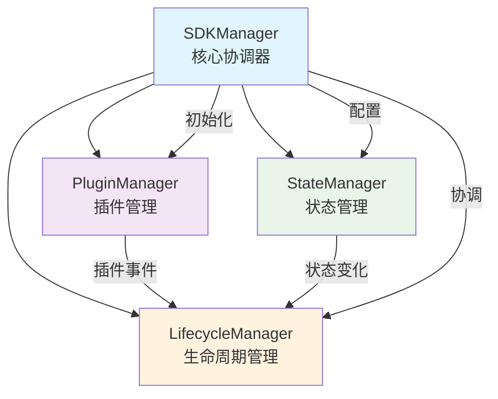

# Core 模块文档索引

本目录包含 React SDK Manager 核心模块的详细文档。每个核心组件都有独立的文档文件，提供完整的API参考、使用示例和最佳实践。

## 核心组件概览

### 🏗️ [SDKManager](./SDKManager.md) - 核心管理器
SDK的主要协调器，负责管理和协调所有子系统的运行。

**主要功能:**
- 初始化和销毁管理
- 配置管理
- 生命周期协调
- 错误处理
- 状态查询

**关键方法:**
- `initialize()` - 异步初始化SDK
- `destroy()` - 安全销毁SDK
- `reset()` - 重置SDK状态
- `getInfo()` - 获取运行时信息

---

### 🔌 [PluginManager](./PluginManager.md) - 插件管理器
负责插件完整生命周期管理的核心组件。

**主要功能:**
- 插件注册和注销
- 插件启用和禁用
- 依赖关系管理
- 循环依赖检测
- 插件查询

**关键方法:**
- `register()` - 注册插件
- `unregister()` - 注销插件
- `enable()` - 启用插件
- `disable()` - 禁用插件
- `getAll()` - 获取所有插件

---

### 🗄️ [StateManager](./StateManager.md) - 状态管理器
提供响应式状态管理功能的核心组件。

**主要功能:**
- 状态获取和设置
- 状态变化订阅
- 状态持久化
- 监听器管理
- 状态重置

**关键方法:**
- `getState()` - 获取当前状态
- `setState()` - 更新状态
- `subscribe()` - 订阅状态变化
- `reset()` - 重置状态

---

### 🔄 [LifecycleManager](./LifecycleManager.md) - 生命周期管理器
管理整个SDK生命周期事件的核心组件。

**主要功能:**
- 生命周期钩子注册
- 同步和异步事件触发
- 错误隔离
- 调试功能
- 钩子管理

**关键方法:**
- `on()` - 注册钩子
- `emit()` - 同步触发钩子
- `emitAsync()` - 异步触发钩子
- `clear()` - 清除钩子

## 架构关系



## 数据流

### 初始化流程
```
SDKManager.initialize()
    ↓
LifecycleManager.emit('beforeMount')
    ↓
PluginManager.register(plugins)
    ↓
StateManager.loadInitialState()
    ↓
LifecycleManager.emit('afterMount')
```

### 状态更新流程
```
StateManager.setState()
    ↓
StateManager.notifyListeners()
    ↓
LifecycleManager.emit('stateChange')
    ↓
Plugin.hooks.onStateChange()
```

### 插件生命周期
```
PluginManager.register()
    ↓
PluginManager.validateDependencies()
    ↓
PluginManager.enable()
    ↓
Plugin.initialize()
    ↓
LifecycleManager.emit('pluginEnabled')
```

## 核心特性

### 🛡️ 错误处理
- **统一错误类型**: 所有组件使用 `SDKError` 统一错误格式
- **错误隔离**: 单个组件的错误不会影响其他组件
- **错误上报**: 通过生命周期系统统一处理错误
- **调试支持**: 调试模式下提供详细错误信息

### 🔄 生命周期集成
- **统一事件系统**: 所有组件通过生命周期管理器通信
- **异步支持**: 支持异步生命周期钩子
- **事件隔离**: 单个钩子的错误不会影响其他钩子
- **调试模式**: 可选的调试日志输出

### 🎯 依赖管理
- **循环依赖检测**: 自动检测并防止循环依赖
- **依赖图维护**: 实时维护插件依赖关系图
- **安全卸载**: 按依赖关系安全卸载插件
- **依赖验证**: 启用插件时验证依赖是否满足

### 💾 状态持久化
- **可选持久化**: 支持状态持久化到 localStorage
- **状态合并**: 智能合并持久化状态和初始状态
- **错误恢复**: 持久化失败时优雅降级
- **类型安全**: 完整的 TypeScript 类型支持

## 使用模式

### 基本初始化
```typescript
import { SDKManager } from '@webscript/react-sdk-manager';

const sdk = new SDKManager({
  name: 'My App SDK',
  version: '1.0.0',
  debug: true,
  initialState: { user: null },
  persist: true
});

await sdk.initialize();
```

### 插件开发
```typescript
import { createPlugin } from '@webscript/react-sdk-manager';

const myPlugin = createPlugin({
  name: 'my-plugin',
  version: '1.0.0',
  dependencies: ['base-plugin'],
  initialize: async () => {
    console.log('Plugin initialized');
  },
  hooks: {
    onStateChange: (state) => {
      console.log('State changed:', state);
    }
  }
});

await sdk.plugins.register(myPlugin);
```

### 状态管理
```typescript
// 获取状态
const state = sdk.state.getState();

// 更新状态
sdk.state.setState({ user: { id: 1, name: 'John' } });

// 订阅状态变化
const unsubscribe = sdk.state.subscribe((newState, prevState) => {
  console.log('State updated:', { newState, prevState });
});
```

### 生命周期钩子
```typescript
// 注册生命周期钩子
sdk.lifecycle.on('afterMount', () => {
  console.log('SDK mounted successfully');
});

sdk.lifecycle.on('error', (error, context) => {
  console.error(`Error in ${context}:`, error);
});
```

## 最佳实践

### 1. 初始化顺序
```typescript
// 正确的初始化顺序
const sdk = new SDKManager(config);
await sdk.initialize(); // 先初始化SDK
await sdk.plugins.register(plugins); // 再注册插件
```

### 2. 错误处理
```typescript
// 统一错误处理
sdk.lifecycle.on('error', (error, context) => {
  // 记录错误
  console.error(`Error in ${context}:`, error);
  
  // 发送到监控服务
  errorReporting.captureException(error, { context });
  
  // 用户通知
  if (error.code === 'CRITICAL_ERROR') {
    showUserNotification('系统遇到错误，请刷新页面');
  }
});
```

### 3. 资源清理
```typescript
// 组件卸载时清理资源
useEffect(() => {
  return () => {
    sdk.destroy(); // 清理SDK资源
  };
}, []);
```

### 4. 性能优化
```typescript
// 避免频繁状态更新
const batchUpdate = useMemo(() => 
  debounce((updates) => {
    sdk.state.setState(updates);
  }, 100), [sdk]
);
```

## 扩展性

### 自定义管理器
```typescript
// 扩展状态管理器
class CustomStateManager extends StateManager {
  // 添加自定义功能
  setWithValidation(newState, validator) {
    if (validator(newState)) {
      this.setState(newState);
    }
  }
}
```

### 中间件支持
```typescript
// 添加中间件支持
class MiddlewareSDKManager extends SDKManager {
  private middlewares = [];
  
  use(middleware) {
    this.middlewares.push(middleware);
  }
  
  // 在关键操作中执行中间件
}
```

## 调试和监控

### 调试模式
```typescript
const sdk = new SDKManager({
  debug: true, // 启用调试模式
  // 其他配置...
});
```

### 性能监控
```typescript
// 监控插件性能
sdk.lifecycle.on('beforeMount', () => {
  console.time('plugin-initialization');
});

sdk.lifecycle.on('afterMount', () => {
  console.timeEnd('plugin-initialization');
});
```

### 状态监控
```typescript
// 监控状态变化频率
let stateChangeCount = 0;
sdk.state.subscribe(() => {
  stateChangeCount++;
  if (stateChangeCount % 100 === 0) {
    console.log(`State changed ${stateChangeCount} times`);
  }
});
```

## 故障排除

### 常见问题

1. **插件依赖错误**
   - 检查插件依赖是否正确注册
   - 验证依赖插件是否已启用
   - 查看是否存在循环依赖

2. **状态持久化失败**
   - 检查 localStorage 是否可用
   - 验证状态是否可序列化
   - 检查存储空间是否充足

3. **生命周期钩子不触发**
   - 确认钩子注册时机
   - 检查是否在正确的生命周期阶段
   - 验证钩子回调函数是否正确

4. **内存泄漏**
   - 确保及时清理监听器
   - 检查插件是否正确销毁
   - 验证生命周期钩子是否清理

### 调试技巧

1. **启用调试模式**: 在开发环境中启用详细日志
2. **使用浏览器开发工具**: 监控内存使用和性能
3. **添加自定义日志**: 在关键位置添加日志输出
4. **单元测试**: 为每个组件编写完整的单元测试

---

## 相关链接

- [项目总体文档](../项目文档.md)
- [React 组件文档](../components/)
- [工具函数文档](../utils/)
- [示例代码](../../examples/)
