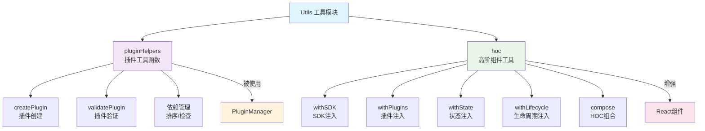

# Utils 工具函数文档索引

本目录包含 React SDK Manager 的工具函数文档。这些工具函数提供了插件开发、组件增强和其他辅助功能，简化了SDK的使用和扩展。

## 工具模块概览

### 🔧 [pluginHelpers](./pluginHelpers.md) - 插件工具函数
提供插件开发和管理的辅助函数集合。

**主要功能:**
- 插件创建和验证
- 依赖关系管理
- 兼容性检查
- 插件排序和分析

**核心函数:**
- `createPlugin()` - 插件创建工厂函数
- `validatePlugin()` - 插件验证函数
- `checkPluginCompatibility()` - 兼容性检查
- `sortPluginsByDependencies()` - 依赖排序
- `getPluginDependencyChain()` - 依赖链获取
- `canUnloadPlugin()` - 卸载检查

---

### 🎯 [hoc](./hoc.md) - 高阶组件工具
提供React高阶组件(HOC)用于组件功能增强。

**主要功能:**
- SDK功能注入
- 组件增强和装饰
- 条件渲染控制
- HOC组合和复用

**核心HOC:**
- `withSDK()` - SDK实例注入
- `withPlugins()` - 插件管理器注入
- `withState()` - 状态管理注入
- `withLifecycle()` - 生命周期管理注入
- `withPluginGuard()` - 插件守卫
- `compose()` - HOC组合函数

## 架构关系



## 使用场景

### 1. 插件开发流程
```
1. 创建插件 → 2. 验证配置 → 3. 检查依赖 → 4. 注册插件
createPlugin()   validatePlugin()  checkCompatibility()  register()
```

### 2. 组件增强流程
```
1. 基础组件 → 2. 选择HOC → 3. 组合增强 → 4. 使用组件
BaseComponent    withSDK等      compose()      Enhanced
```

## 核心特性

### 🔧 插件工具特性
- **简化创建**: 提供便捷的插件创建接口
- **依赖管理**: 完整的依赖关系处理
- **验证机制**: 确保插件配置的正确性
- **兼容性检查**: 自动检查插件兼容性

### 🎯 HOC工具特性
- **声明式增强**: 声明式的组件功能增强
- **类型安全**: 完整的TypeScript类型支持
- **组合能力**: 支持多个HOC的组合使用
- **性能优化**: 内置性能优化机制

## 快速开始

### 1. 插件开发

```typescript
import { createPlugin, validatePlugin } from '@react-sdk/manager';

// 创建插件
const myPlugin = createPlugin({
  name: 'my-awesome-plugin',
  version: '1.0.0',
  dependencies: ['base-plugin'],
  
  component: ({ sdk }) => {
    const [state, setState] = useSDKState();
    
    return (
      <div>
        <h3>My Awesome Plugin</h3>
        <p>Current user: {state.user?.name}</p>
      </div>
    );
  },
  
  hooks: {
    onMount: () => console.log('Plugin mounted'),
    onStateChange: (newState, prevState) => {
      console.log('State changed:', { newState, prevState });
    }
  }
});

// 验证插件
const errors = validatePlugin(myPlugin);
if (errors.length === 0) {
  console.log('Plugin is valid!');
} else {
  console.error('Plugin validation errors:', errors);
}
```

### 2. 组件增强

```typescript
import React from 'react';
import { 
  withSDK, 
  withState, 
  withPlugins, 
  compose,
  WithSDKProps,
  WithStateProps,
  WithPluginsProps
} from '@react-sdk/manager';

// 基础组件
interface DashboardProps {
  title: string;
}

type EnhancedProps = DashboardProps & 
  WithSDKProps & 
  WithStateProps & 
  WithPluginsProps;

const Dashboard: React.FC<EnhancedProps> = ({ 
  title, 
  sdk, 
  state, 
  setState, 
  plugins 
}) => {
  const handleLogin = () => {
    setState(prev => ({
      ...prev,
      user: { name: 'John Doe', id: '123' }
    }));
  };

  return (
    <div>
      <h1>{title}</h1>
      <p>SDK Version: {sdk.getConfig().version}</p>
      <p>Active Plugins: {plugins.getEnabled().length}</p>
      
      {state.user ? (
        <p>Welcome, {state.user.name}!</p>
      ) : (
        <button onClick={handleLogin}>Login</button>
      )}
    </div>
  );
};

// 使用HOC增强组件
const EnhancedDashboard = compose(
  withSDK,
  withState,
  withPlugins
)(Dashboard);

// 使用增强后的组件
<EnhancedDashboard title="My Dashboard" />
```

### 3. 插件依赖管理

```typescript
import { 
  sortPluginsByDependencies, 
  checkPluginCompatibility,
  getPluginDependencyChain 
} from '@react-sdk/manager';

const plugins = [
  createPlugin({ name: 'app', version: '1.0.0', dependencies: ['ui', 'auth'] }),
  createPlugin({ name: 'ui', version: '1.0.0', dependencies: ['base'] }),
  createPlugin({ name: 'auth', version: '1.0.0', dependencies: ['base'] }),
  createPlugin({ name: 'base', version: '1.0.0' })
];

// 按依赖顺序排序
const sortedPlugins = sortPluginsByDependencies(plugins);
console.log('Installation order:', sortedPlugins.map(p => p.name));
// 输出: ['base', 'ui', 'auth', 'app']

// 检查兼容性
const newPlugin = createPlugin({
  name: 'new-feature',
  version: '1.0.0',
  dependencies: ['ui', 'missing-plugin']
});

const compatibility = checkPluginCompatibility(newPlugin, plugins);
console.log('Compatibility:', compatibility);
// 输出: { compatible: false, missingDependencies: ['missing-plugin'] }

// 获取依赖链
const dependencyChain = getPluginDependencyChain('app', plugins);
console.log('App dependencies:', dependencyChain);
// 输出: ['base', 'ui', 'auth']
```

## 高级使用模式

### 1. 插件工厂模式

```typescript
import { createPlugin } from '@react-sdk/manager';

// 创建插件工厂
class WidgetPluginFactory {
  private baseConfig: any;
  
  constructor(baseConfig = {}) {
    this.baseConfig = baseConfig;
  }
  
  createWidget(name: string, config: any) {
    return createPlugin({
      ...this.baseConfig,
      name: `widget-${name}`,
      version: '1.0.0',
      component: ({ sdk }) => <Widget config={config} sdk={sdk} />,
      hooks: {
        onMount: () => console.log(`Widget ${name} mounted`),
        onError: (error) => console.error(`Widget ${name} error:`, error)
      }
    });
  }
}

// 使用工厂
const factory = new WidgetPluginFactory({
  dependencies: ['ui-framework']
});

const weatherWidget = factory.createWidget('weather', { 
  location: 'Beijing',
  units: 'metric' 
});

const stockWidget = factory.createWidget('stock', { 
  symbols: ['AAPL', 'GOOGL', 'MSFT'] 
});
```

### 2. 自定义HOC组合

```typescript
import { compose, withSDK, withState, withPlugins } from '@react-sdk/manager';

// 创建常用的HOC组合
const withFullSDKAccess = compose(
  withSDK,
  withState,
  withPlugins
);

// 创建特定用途的HOC组合
const withUserManagement = compose(
  withSDK,
  withState
);

const withPluginManagement = compose(
  withSDK,
  withPlugins
);

// 应用到多个组件
const UserDashboard = withUserManagement(BaseUserDashboard);
const PluginSettings = withPluginManagement(BasePluginSettings);
const AdminPanel = withFullSDKAccess(BaseAdminPanel);
```

### 3. 条件插件加载

```typescript
import { 
  createPlugin, 
  checkPluginCompatibility, 
  canUnloadPlugin 
} from '@react-sdk/manager';

// 条件插件加载器
class ConditionalPluginLoader {
  private availablePlugins: Plugin[] = [];
  
  async loadPlugin(pluginConfig: any, condition: () => boolean) {
    if (!condition()) {
      console.log(`Skipping plugin ${pluginConfig.name} - condition not met`);
      return null;
    }
    
    const plugin = createPlugin(pluginConfig);
    
    // 检查兼容性
    const compatibility = checkPluginCompatibility(plugin, this.availablePlugins);
    if (!compatibility.compatible) {
      console.error(`Plugin ${plugin.name} missing dependencies:`, 
        compatibility.missingDependencies);
      return null;
    }
    
    this.availablePlugins.push(plugin);
    return plugin;
  }
  
  async unloadPlugin(pluginName: string) {
    const canUnload = canUnloadPlugin(pluginName, this.availablePlugins);
    if (!canUnload.canUnload) {
      console.error(`Cannot unload ${pluginName} - required by:`, 
        canUnload.dependents);
      return false;
    }
    
    this.availablePlugins = this.availablePlugins.filter(p => p.name !== pluginName);
    return true;
  }
}

// 使用条件加载器
const loader = new ConditionalPluginLoader();

// 只在生产环境加载分析插件
await loader.loadPlugin({
  name: 'analytics-plugin',
  version: '1.0.0'
}, () => process.env.NODE_ENV === 'production');

// 只在用户是管理员时加载管理插件
await loader.loadPlugin({
  name: 'admin-plugin',
  version: '1.0.0'
}, () => user.role === 'admin');
```

### 4. 智能HOC选择

```typescript
import { withSDK, withState, withPlugins, compose } from '@react-sdk/manager';

// 智能HOC选择器
const createSmartHOC = (requirements: {
  needsSDK?: boolean;
  needsState?: boolean;
  needsPlugins?: boolean;
  needsLifecycle?: boolean;
}) => {
  const hocs = [];
  
  if (requirements.needsSDK) hocs.push(withSDK);
  if (requirements.needsState) hocs.push(withState);
  if (requirements.needsPlugins) hocs.push(withPlugins);
  if (requirements.needsLifecycle) hocs.push(withLifecycle);
  
  return hocs.length > 0 ? compose(...hocs) : (component: any) => component;
};

// 使用智能选择器
const UserComponent = createSmartHOC({
  needsSDK: true,
  needsState: true
})(BaseUserComponent);

const PluginComponent = createSmartHOC({
  needsSDK: true,
  needsPlugins: true
})(BasePluginComponent);

const SimpleComponent = createSmartHOC({})(BaseSimpleComponent); // 不添加任何HOC
```

## 性能优化

### 1. 插件懒加载

```typescript
import { createPlugin } from '@react-sdk/manager';

// 懒加载插件创建器
const createLazyPlugin = (config: any) => {
  return createPlugin({
    ...config,
    component: React.lazy(() => import(`./plugins/${config.name}`)),
    initialize: async () => {
      // 延迟初始化
      await new Promise(resolve => setTimeout(resolve, 100));
      console.log(`Plugin ${config.name} initialized lazily`);
    }
  });
};

// 使用懒加载
const lazyPlugin = createLazyPlugin({
  name: 'heavy-plugin',
  version: '1.0.0'
});
```

### 2. HOC性能优化

```typescript
import React from 'react';
import { withSDK, WithSDKProps } from '@react-sdk/manager';

// 优化的HOC实现
const withOptimizedSDK = <P extends object>(
  Component: React.ComponentType<P & WithSDKProps>
) => {
  // 使用React.memo优化
  const MemoizedComponent = React.memo(Component);
  
  return React.memo<P>((props) => {
    const sdk = useSDK();
    
    // 只有SDK实例变化时才重新渲染
    return <MemoizedComponent {...props} sdk={sdk} />;
  });
};

// 选择性状态订阅
const withSelectiveState = <T, P extends object>(
  selector: (state: any) => T,
  Component: React.ComponentType<P & { selectedState: T }>
) => {
  return React.memo<P>((props) => {
    const [fullState] = useSDKState();
    const selectedState = React.useMemo(() => selector(fullState), [fullState]);
    
    return <Component {...props} selectedState={selectedState} />;
  });
};
```

## 测试策略

### 1. 插件工具测试

```typescript
import { createPlugin, validatePlugin, sortPluginsByDependencies } from '@react-sdk/manager';

describe('Plugin Helpers', () => {
  test('createPlugin creates valid plugin', () => {
    const plugin = createPlugin({
      name: 'test-plugin',
      version: '1.0.0'
    });
    
    expect(plugin.name).toBe('test-plugin');
    expect(plugin.version).toBe('1.0.0');
    expect(plugin.enabled).toBe(true);
  });
  
  test('validatePlugin catches errors', () => {
    const invalidPlugin = createPlugin({
      name: '',
      version: '1.0.0'
    });
    
    const errors = validatePlugin(invalidPlugin);
    expect(errors).toContain('Plugin name is required');
  });
  
  test('sortPluginsByDependencies orders correctly', () => {
    const plugins = [
      createPlugin({ name: 'c', version: '1.0.0', dependencies: ['b'] }),
      createPlugin({ name: 'b', version: '1.0.0', dependencies: ['a'] }),
      createPlugin({ name: 'a', version: '1.0.0' })
    ];
    
    const sorted = sortPluginsByDependencies(plugins);
    expect(sorted.map(p => p.name)).toEqual(['a', 'b', 'c']);
  });
});
```

### 2. HOC测试

```typescript
import React from 'react';
import { render, screen } from '@testing-library/react';
import { withSDK, SDKProvider } from '@react-sdk/manager';

describe('HOC Tests', () => {
  const TestComponent = ({ sdk, title }: { sdk: any; title: string }) => (
    <div>
      <h1>{title}</h1>
      <p>SDK Version: {sdk.getConfig().version}</p>
    </div>
  );
  
  const EnhancedComponent = withSDK(TestComponent);
  
  test('withSDK injects SDK instance', () => {
    render(
      <SDKProvider config={{ name: 'Test SDK', version: '1.0.0' }}>
        <EnhancedComponent title="Test" />
      </SDKProvider>
    );
    
    expect(screen.getByText('Test')).toBeInTheDocument();
    expect(screen.getByText('SDK Version: 1.0.0')).toBeInTheDocument();
  });
});
```

## 最佳实践

### 1. 插件开发

```typescript
// ✅ 好的实践
const goodPlugin = createPlugin({
  name: 'user-profile-widget',  // 清晰的命名
  version: '1.2.3',            // 语义化版本
  dependencies: ['auth-service'], // 明确的依赖
  
  initialize: async () => {
    // 异步初始化
    await loadUserData();
  },
  
  destroy: async () => {
    // 清理资源
    cleanup();
  },
  
  hooks: {
    onError: (error) => {
      // 错误处理
      console.error('Plugin error:', error);
    }
  }
});

// ❌ 避免的实践
const badPlugin = createPlugin({
  name: 'plugin1',              // 不清晰的命名
  version: '1.0',               // 不完整的版本号
  // 缺少错误处理和资源清理
});
```

### 2. HOC使用

```typescript
// ✅ 好的实践
const EnhancedComponent = compose(
  withSDK,
  withState,
  React.memo  // 性能优化
)(BaseComponent);

// 设置显示名称
EnhancedComponent.displayName = 'Enhanced(BaseComponent)';

// ❌ 避免的实践
const BadComponent = withSDK(withState(withPlugins(BaseComponent))); // 难以阅读
```

### 3. 类型安全

```typescript
// ✅ 类型安全的插件创建
interface PluginConfig {
  apiKey: string;
  endpoint: string;
}

const createTypedPlugin = (config: PluginConfig) => {
  return createPlugin({
    name: 'api-plugin',
    version: '1.0.0',
    component: ({ sdk }) => <ApiComponent config={config} sdk={sdk} />
  });
};

// ✅ 类型安全的HOC使用
interface ComponentProps {
  title: string;
  data: any[];
}

const TypedComponent: React.FC<ComponentProps & WithSDKProps> = ({
  title,
  data,
  sdk
}) => {
  // 完整的类型支持
  return <div>{title}</div>;
};
```

## 故障排除

### 常见问题

1. **插件依赖错误**
   ```
   Error: Circular dependency detected involving plugin: plugin-a
   ```
   - 检查插件依赖关系
   - 使用依赖图分析工具
   - 重新设计插件架构

2. **HOC类型错误**
   ```
   Type 'ComponentType<P>' is not assignable to type 'ComponentType<P & WithSDKProps>'
   ```
   - 确保组件Props包含HOC要求的Props
   - 检查类型定义的正确性
   - 使用正确的泛型参数

3. **插件验证失败**
   ```
   Plugin validation failed: Plugin name is required
   ```
   - 检查插件配置的完整性
   - 使用validatePlugin函数预检查
   - 确保必需字段不为空

### 调试技巧

1. **启用调试模式**
   ```typescript
   const plugin = createPlugin({
     name: 'debug-plugin',
     version: '1.0.0',
     hooks: {
       onMount: () => console.log('Plugin mounted'),
       onError: (error) => console.error('Plugin error:', error)
     }
   });
   ```

2. **使用开发工具**
   ```typescript
   // 在开发环境中添加调试信息
   if (process.env.NODE_ENV === 'development') {
     console.log('Plugin dependency chain:', getPluginDependencyChain(pluginName, plugins));
   }
   ```

3. **HOC调试**
   ```typescript
   const withDebugSDK = (Component) => {
     const WrappedComponent = withSDK(Component);
     WrappedComponent.displayName = `withDebugSDK(${Component.name})`;
     return WrappedComponent;
   };
   ```

---

## 相关链接

- [项目总体文档](../项目文档.md)
- [核心模块文档](../core/)
- [React组件文档](../components/)
- [示例代码](../../examples/)
